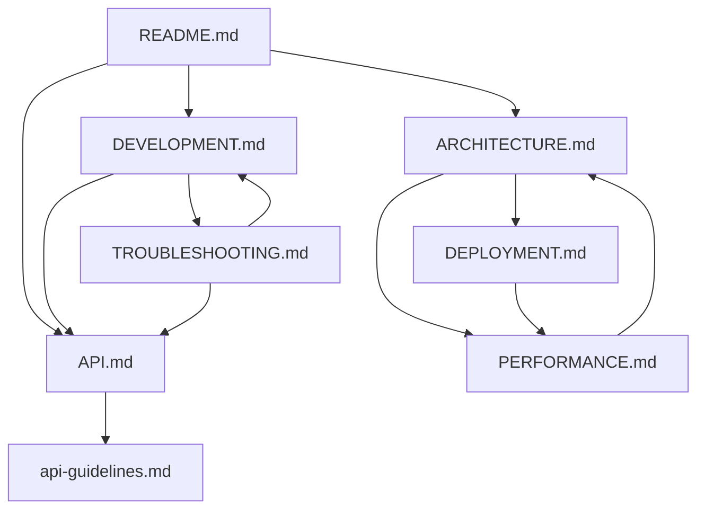

# Open Stream Documentation

Welcome to the comprehensive documentation for Open Stream - an AI-powered desktop application for content analysis and moderation. This documentation covers all aspects from development to deployment.

## Quick Navigation

### 🚀 Getting Started
- **[Development Guide](development/DEVELOPMENT.md)** - Set up your development environment and start contributing
- **[API Reference](api/API.md)** - Complete API documentation for all endpoints and integrations

### 🏗️ Architecture & Design
- **[System Architecture](architecture/ARCHITECTURE.md)** - Deep dive into the three-process architecture design
- **[API Guidelines](api/api-guidelines.md)** - API design patterns and best practices

### 🚀 Deployment & Operations  
- **[Deployment Guide](deployment/DEPLOYMENT.md)** - Build and distribution processes for all platforms
- **[Performance Optimization](performance/PERFORMANCE.md)** - Comprehensive performance tuning strategies

### 🔧 Maintenance & Support
- **[Troubleshooting Guide](troubleshooting/TROUBLESHOOTING.md)** - Solutions for common issues and problems

## Documentation Structure

```
docs/
├── README.md                     # This navigation document
├── api/                         # API Documentation
│   ├── API.md                   # Complete API reference
│   └── api-guidelines.md        # API design patterns and best practices
├── architecture/                # System Design
│   └── ARCHITECTURE.md          # Three-process architecture overview
├── development/                 # Developer Resources
│   └── DEVELOPMENT.md           # Development setup and workflow
├── deployment/                  # Build & Distribution
│   └── DEPLOYMENT.md            # Cross-platform build processes
├── performance/                 # Optimization
│   └── PERFORMANCE.md           # Performance tuning strategies
└── troubleshooting/            # Support & Issues
    └── TROUBLESHOOTING.md       # Common problems and solutions
```

## Technology Stack Overview

**Frontend**: Electron + React 19.1.0 + TypeScript 5.8.3  
**Backend**: Python FastAPI + Hugging Face Transformers  
**AI Models**: BERT-based toxicity detection and sentiment analysis  
**Build System**: Vite + Electron Builder + PNPM

## Key Features

- **AI-Powered Analysis**: Advanced toxicity detection and sentiment analysis using state-of-the-art transformer models
- **Desktop Application**: Cross-platform Electron app for Windows, macOS, and Linux
- **Three-Process Architecture**: Secure IPC communication between React frontend, Electron main process, and Python backend
- **Real-time Processing**: Fast inference with model caching and optimization
- **Developer-Friendly**: Comprehensive TypeScript types and development tooling

## Document Relationships



## Getting Started Paths

### For New Developers
1. Start with **[Development Guide](development/DEVELOPMENT.md)** for environment setup
2. Review **[System Architecture](architecture/ARCHITECTURE.md)** to understand the design
3. Explore **[API Reference](api/API.md)** for implementation details
4. Use **[Troubleshooting Guide](troubleshooting/TROUBLESHOOTING.md)** when issues arise

### For System Administrators
1. Begin with **[Deployment Guide](deployment/DEPLOYMENT.md)** for build processes
2. Review **[Performance Optimization](performance/PERFORMANCE.md)** for tuning
3. Keep **[Troubleshooting Guide](troubleshooting/TROUBLESHOOTING.md)** handy for user support

### For API Consumers
1. Start with **[API Reference](api/API.md)** for endpoint documentation
2. Review **[API Guidelines](api/api-guidelines.md)** for best practices
3. Check **[System Architecture](architecture/ARCHITECTURE.md)** for integration patterns

## Contributing to Documentation

When updating documentation:

1. **Maintain Cross-References**: Update related documents when making changes
2. **Keep Examples Current**: Ensure code examples work with the latest version
3. **Follow Structure**: Match the established format and organization
4. **Update Navigation**: Modify this README if adding new documents

## Document Maintenance

| Document | Last Updated | Next Review | Owner |
|----------|--------------|-------------|-------|
| [DEVELOPMENT.md](development/DEVELOPMENT.md) | 2025-08-13 | 2025-09-13 | Dev Team |
| [API.md](api/API.md) | 2025-08-13 | 2025-09-13 | Backend Team |
| [ARCHITECTURE.md](architecture/ARCHITECTURE.md) | 2025-08-13 | 2025-10-13 | Tech Lead |
| [DEPLOYMENT.md](deployment/DEPLOYMENT.md) | 2025-08-13 | 2025-09-13 | DevOps |
| [PERFORMANCE.md](performance/PERFORMANCE.md) | 2025-08-13 | 2025-09-13 | Performance Team |
| [TROUBLESHOOTING.md](troubleshooting/TROUBLESHOOTING.md) | 2025-08-13 | 2025-09-13 | Support Team |

## External Resources

- **[Electron Documentation](https://electronjs.org/docs)** - Desktop application framework
- **[FastAPI Documentation](https://fastapi.tiangolo.com)** - Python web framework
- **[Hugging Face Transformers](https://huggingface.co/docs/transformers)** - AI model library
- **[React Documentation](https://react.dev)** - UI library
- **[TypeScript Handbook](https://typescriptlang.org/docs)** - Type system guide

## Support Channels

- **GitHub Issues**: Technical problems and bug reports
- **GitHub Discussions**: Feature requests and community Q&A
- **Documentation Issues**: Report documentation problems or suggestions

---

**Last Updated**: August 13, 2025  
**Documentation Version**: 2.0.0  
**Application Version**: Corresponds to latest release